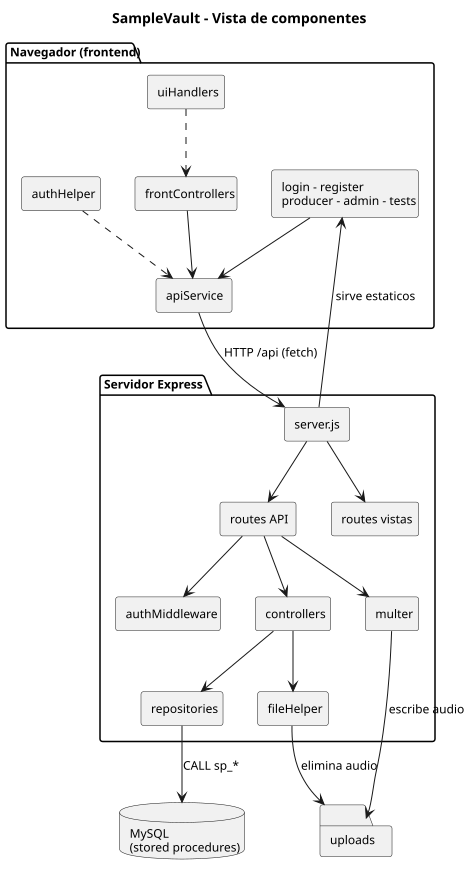
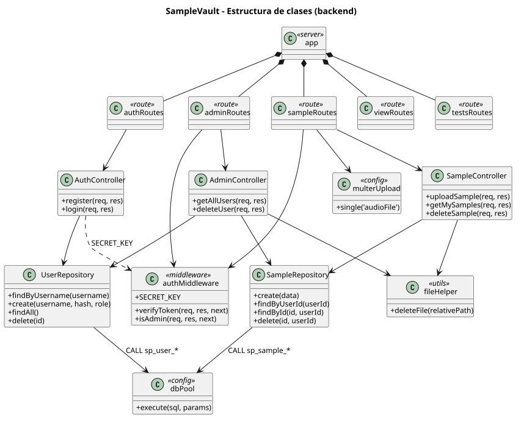
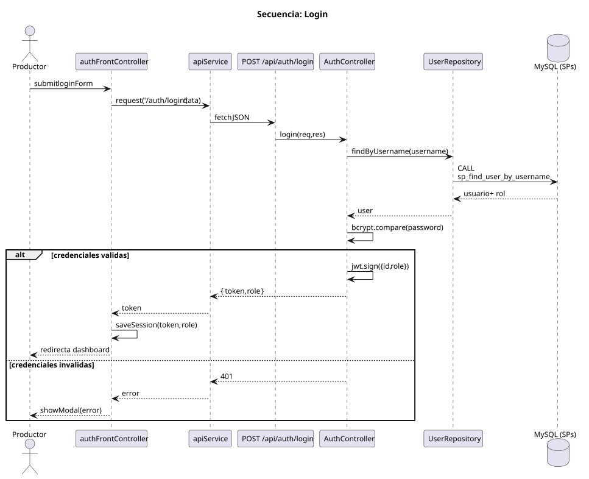
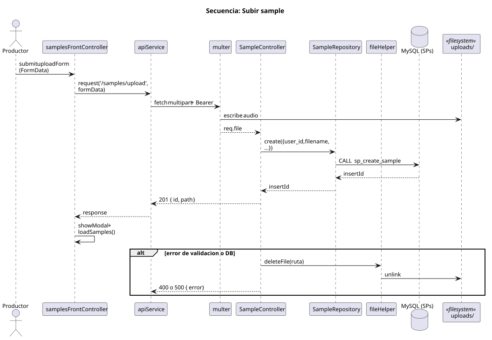
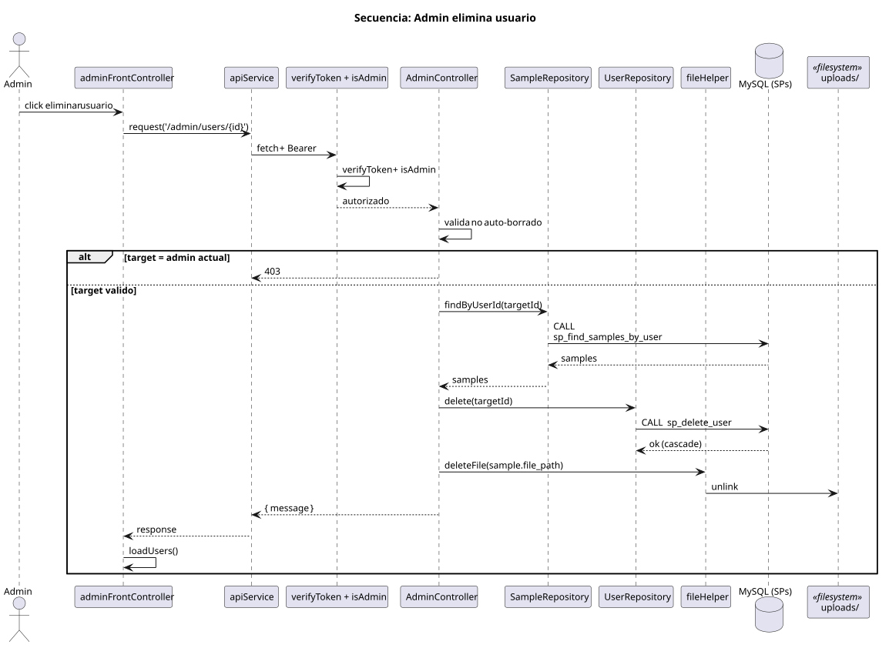

# SampleVault — Architecture & Design Report

SampleVault is a web application for managing personal sound-sample libraries. A music producer can upload, categorize, listen to and delete audio samples; an administrator can manage users and their samples. This report describes the system's architecture and design, using the deep-module vocabulary (module, interface, implementation, depth, seam, adapter, leverage, locality).

---

## 1. Overview and architectural style

The system is a **two-tier client–server application**:

- A **backend** in Node.js + Express that exposes a JSON HTTP interface (`/api`), serves the static frontend, and persists metadata in MySQL through stored procedures. Binary audio lives on the server filesystem under `uploads/`.
- A **frontend** of static HTML + vanilla JavaScript that crosses the HTTP seam with `fetch`, keeps session state in `localStorage`, and renders the DOM with native node manipulation (no `innerHTML`).

The main seam of the whole system is the **HTTP API at `/api`**: it is the single interface through which the frontend (and the browser-based test harness) exercises the application. Everything north of that seam is the frontend; everything south is the backend.




**Flow at a glance.** The browser loads static assets served by Express. The JS modules (`apiService`, `frontControllers`) issue requests to `/api`. Express routes dispatch to middleware (authentication, multer) and controllers, which read/write through repositories backed by stored procedures, and touch the filesystem through `fileHelper`.

---

## 2. Module map

The table below lists the modules that carry real behaviour. Depth is judged as leverage at the interface: how much behaviour each small interface exposes.

| Module | Interface (what callers learn) | Implementation behind it | Depth |
|---|---|---|---|
| `apiService` (frontend) | `request(endpoint, method, data, isFormData)` | fetch wrapper, auth header injection, JSON/FormData handling, 401 auto-logout, error normalization | Deep |
| `authHelper` (frontend) | `saveSession`, `getToken`, `logout`, `initLogoutButtons` | centralizes `localStorage` access and logout wiring | Medium |
| `uiHandlers` (frontend) | `showModal(title, message)` | builds and reuses a W3.CSS modal with native DOM nodes | Deep |
| `authMiddleware` (backend) | `verifyToken`, `isAdmin`, `SECRET_KEY` | JWT decode/verify, Bearer format check, role guard | Deep |
| `multerConfig` (backend) | a ready `single('audioFile')` middleware | disk storage, unique filenames, audio-only filter, upload dir creation | Deep |
| `AuthController` | `register`, `login` | presence validation, bcrypt hashing/compare, JWT signing, duplicate-user handling | Medium |
| `SampleController` | `uploadSample`, `getMySamples`, `deleteSample` | validation, ownership checks, orphan-file cleanup on failure | Medium |
| `AdminController` | `getAllUsers`, `deleteUser` | business rule (no self-deletion), user + samples removal, filesystem cleanup | Medium |
| `UserRepository` / `SampleRepository` | 4 small CRUD methods each | stored-procedure calls, result-set unwrapping (`rows[0][0]`) | Deep adapters |
| `fileHelper` | `deleteFile(relativePath)` | safe path resolution and idempotent unlink | Shallow |
| **Stored procedures** (DB) | one `sp_*` procedure per operation | SQL, joins, ownership constraints, integrity | Very deep |
| `viewRoutes` / `testsRoutes` | route → HTML file mapping | navigation / test-page delivery, 404 handling | Shallow |

The design hides most behaviour behind small interfaces. The deepest modules — the repositories and the stored procedures behind them — concentrate all SQL, ownership validation and referential integrity in one place, so callers never see a SQL string.

---

## 3. Class structure (backend)



The backend is a small layered chain: **server → routes → (middleware) → controllers → repositories → db pool / fileHelper**. Each controller is a singleton (`module.exports = new X()`). Dependencies flow one way:

- Routes carry no logic; they bind HTTP paths to middleware and controllers.
- Controllers orchestrate: validate input, call repositories, decide responses.
- Repositories are the only modules that talk to the database, always through stored procedures.
- `authMiddleware` doubles as the source of `SECRET_KEY`, which `AuthController` imports — the one upstream-looking dependency, kept because signing and verification must share a single key.

Note that repositories are **adapters at the data-access seam**: their interface is a small set of domain-shaped operations (`findByUsername`, `create`, …), while their implementation deals with `CALL sp_*` and result-set unwrapping. Swapping MySQL for another store would only touch these adapters.

---

## 4. Key seams

| Seam | Location | Interface | Adapters |
|---|---|---|---|
| **HTTP API** | `/api/auth`, `/api/samples`, `/api/admin` | JSON requests/responses, JWT in `Authorization: Bearer` | `apiService` (client), Express routes (server), test harness |
| **Authentication** | mounted on `sampleRoutes` and `adminRoutes` | `verifyToken` then `isAdmin` | middleware chain |
| **File upload** | mounted on `POST /api/samples/upload` | multipart field `audioFile` | `multer` adapter writing to `uploads/` |
| **Data access** | repositories → MySQL | domain-shaped methods | stored procedures |
| **Filesystem** | controllers → `fileHelper` | `deleteFile(relativePath)` | `fs` adapter |
| **View delivery** | `/` fallback router | HTML files by route | `viewRoutes` vs `testsRoutes` selected by `NODE_ENV` |

Two facts are worth highlighting:

1. **The interface is the test surface.** The browser test harness (`tests.html`) crosses exactly the same HTTP seam as the production frontend — same endpoints, same auth headers. This matches the principle that callers and tests should cross the same seam.
2. **Least privilege at the DB.** The application DB user is granted only `SELECT` and `EXECUTE`; all writes happen inside stored procedures. The stored procedures therefore are a deliberate seam: the app has no direct `INSERT`/`UPDATE`/`DELETE` capability.

---

## 5. Workflows

### 5.1 Authentication (login)



1. The login form handler calls `apiService.request('/auth/login', {username, password})`.
2. `AuthController` looks the user up via `UserRepository.findByUsername` (which calls `sp_find_user_by_username`, returning the user **with its role** thanks to the JOIN).
3. `bcrypt.compare` validates the password. On success a JWT signed with `SECRET_KEY` and expiring in 2h is returned; the frontend stores `token` + `role` and redirects to the dashboard matching the role.
4. On failure the backend answers 401/400 and the frontend shows the error through `showModal`.

### 5.2 Sample upload



1. The producer form builds a `FormData` (metadata + `audioFile`) and sends it through `apiService`.
2. `multer` validates the MIME type, writes the file to `uploads/` with a timestamped unique name, and attaches it to `req.file`.
3. `SampleController` validates metadata, then persists a row via `SampleRepository.create` → `sp_create_sample`, using `req.userId` from the JWT.
4. On any validation or DB error, the controller deletes the just-written file so no orphan audio remains (resource efficiency).

### 5.3 Admin deletes a user



1. The admin panel issues `DELETE /api/admin/users/{id}`; `verifyToken` + `isAdmin` gate the route.
2. `AdminController` blocks self-deletion (403), lists the target user's samples, deletes the user via `sp_delete_user` (referential cascade removes rows), then removes each audio file from disk.

---

## 6. Design notes and refactoring opportunities

These are observations against the deep-module goals (leverage, locality, clean seams), in the spirit of this repo's "laboratorio-refactoring" purpose.

1. **Hardcoded host in the frontend.** `samplesFrontController.js` builds the audio URL as `http://localhost:3000${s.file_path}`. This makes the frontend depend on a configuration fact, and breaks once the host differs. Better: request `s.file_path` relative (`/uploads/...`) and let the browser resolve it against the served origin, matching how `apiService` already uses the relative `/api` base.

2. **Three different upload-dir resolutions.** `server.js` creates `uploads` from `__dirname`; `multerConfig` computes it from `process.cwd()`; `fileHelper.deleteFile` resolves from `process.cwd()` too. These agree only when the server is started from `backend/`. This is a latent seam mismatch — the filesystem path is a small interface that should be computed once and shared.

3. **Frontend modules are implicit globals.** `apiService`, `authHelper` and `showModal` are global-scope singletons wired by script-tag order, so the "interface" the caller must learn includes the load order in every HTML page. Consolidating them into real module imports (or a single boot module) would make the dependency graph explicit and testable at the module seam rather than through `document`.

4. **Repositories leak their unwrapping into their return shape.** `rows[0][0]` and `rows[0]` are the repository's actual interface; every caller must know which SP returns a single row vs. a set. A thin normalization inside each repository method would make the interface uniformly domain-shaped.

5. **Error handling sends `error.message` to clients.** The global error handler and controller catches expose internal details (e.g., MySQL codes). A consistent error module that maps failures to stable status codes and safe messages would deepen the API interface at low cost.

6. **The test harness lives behind `NODE_ENV=testing`.** Tests cross the right seam (the HTTP API), which is good — but they are browser-driven and ad hoc, not part of a repeatable test run. Since the seam is clean, an automated suite (supertest against `app` without `listen`) could exercise the same interface headlessly.

7. **Strong points worth keeping.** Ownership is enforced both in middleware (JWT) and inside stored procedures (`sp_find_sample_by_id`, `sp_delete_sample` take `user_id` and match it) — defense in depth at two seams. The "zero innerHTML" frontend keeps XSS surface small by construction.

---

## 7. Diagram sources

The PlantUML sources live in `docs/diagrams/*.puml` and compile to SVG via `plantuml -tsvg`:

```bash
plantuml -tsvg -o svg docs/diagrams/components.puml docs/diagrams/class.puml docs/diagrams/sequence-auth.puml docs/diagrams/sequence-upload.puml docs/diagrams/sequence-admin.puml
```

- `components.puml` → `diagrams/svg/components.svg` (Section 1)
- `class.puml` → `diagrams/svg/class.svg` (Section 3)
- `sequence-auth.puml` → `diagrams/svg/sequence-auth.svg` (Section 5.1)
- `sequence-upload.puml` → `diagrams/svg/sequence-upload.svg` (Section 5.2)
- `sequence-admin.puml` → `diagrams/svg/sequence-admin.svg` (Section 5.3)