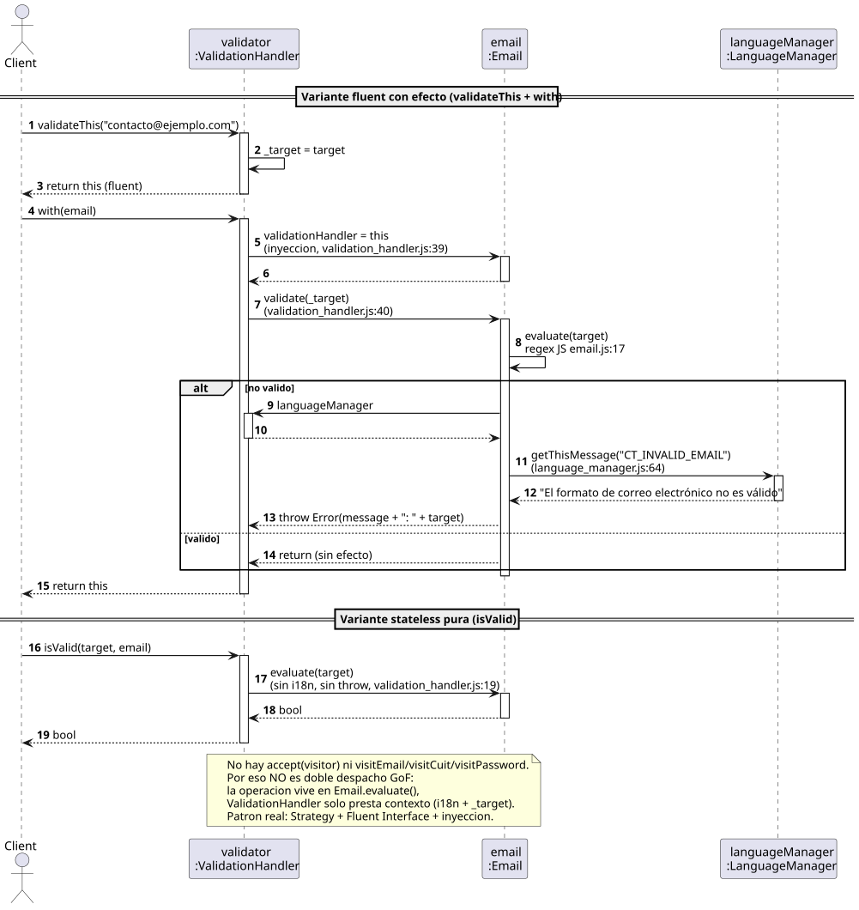

# Visitor Pattern Analysis — ValidationHandler / Email / LanguageManager

Veredicto en una línea: el `ValidationHandler` JS **no implementa Visitor GoF**
(falta `accept`/`visit*` y doble despacho). Patrón real:
**Strategy + Fluent Interface + inyección para i18n**.

## Diagrama de secuencia (flujo real JS)



Fuente: [sequence-validation-handler-email.puml](sequence-validation-handler-email.puml)
(se regenera con `plantuml -tsvg docs/visitor/sequence-validation-handler-email.puml`
desde `2026-08-26-practico-visitor-pattern-analysis/`).

Dos variantes:

- `validateThis(target).with(email)` — con efecto: inyecta `this`
  (`validation_handler.js:39`), delega `validate()` (`:40`), y `Email`
  hace callback i18n a `LanguageManager.getThisMessage()` (`language_manager.js:64`),
  lanzando `Error` si no valida.
- `isValid(target, email)` — stateless/pura: solo `evaluate()`, sin throw ni i18n.

## Mapeo Refactoring.Guru / GoF vs JS

| Rol GoF | Esperado | JS real | Veredicto |
|---|---|---|---|
| Visitor | `visitEmail/visitCuit/visitPassword` | No existe (`isValid/validateThis/with`) | No cumple |
| ConcreteVisitor | Lógica por tipo en visitante | Lógica en `Email.evaluate()` | No cumple |
| Element | `accept(Visitor&)` | `evaluate()/validate()` implícito | Parcial |
| ConcreteElement | `accept(){ v.visitX(this); }` | `validate()` con callback i18n, sin anunciar tipo | Parcial |
| ObjectStructure | Itera `shapes->accept(v)` | `with()` visita un solo elemento | No cumple |

## Implementación C++ comparativa

[visitor-pattern-analysis.cpp](visitor-pattern-analysis.cpp) — Email/Cuit/Password:

- `namespace faithful`: réplica 1:1 del JS (preserva el bug `""==válido`
  del `?` final del regex; Cuit con checksum AFIP y Password documentadas
  porque los `.js` son stubs vacíos).
- `namespace canonical`: Visitor puro (`Visitor::visit*`, `Validation::accept()`,
  `ValidationSuite` como ObjectStructure, `BoolValidator`/`ThrowingValidator`).

Compila y corre:

```bash
g++ -std=c++17 -Wall -Wextra -o /tmp/opencode/visitor-test docs/visitor/visitor-pattern-analysis.cpp
/tmp/opencode/visitor-test
```
