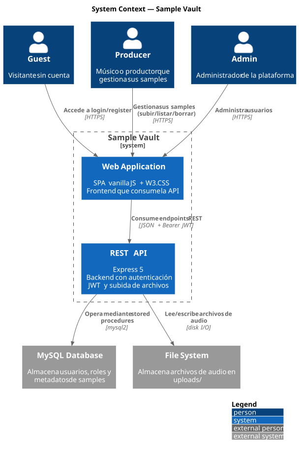

# Diagrama de Contexto — Sample Vault

> System Boundary usando notación C4. Muestra los actores, el sistema y los sistemas externos.

## Actores

| Actor | Descripción |
| ------- | ------------- |
| **Guest** | Visitante sin cuenta. Solo accede a login/register. |
| **Producer** | Usuario registrado con rol `producer`. Gestiona samples (subir, listar, borrar). |
| **Admin** | Usuario registrado con rol `admin`. Administra usuarios (listar, eliminar). |

## Sistemas externos

| Sistema | Rol |
| --------- | --- |
| **MySQL Database** | Persistencia de usuarios, roles, metadatos de samples. Acceso exclusivamente mediante stored procedures. |
| **File System** | Almacenamiento de archivos de audio en `uploads/`. |

## Límite del sistema

Queda fuera del sistema Sample Vault:

- Autenticación OAuth / SSO
- CDN para distribución de audio
- Replicación de la base de datos
- Backup automatizado
