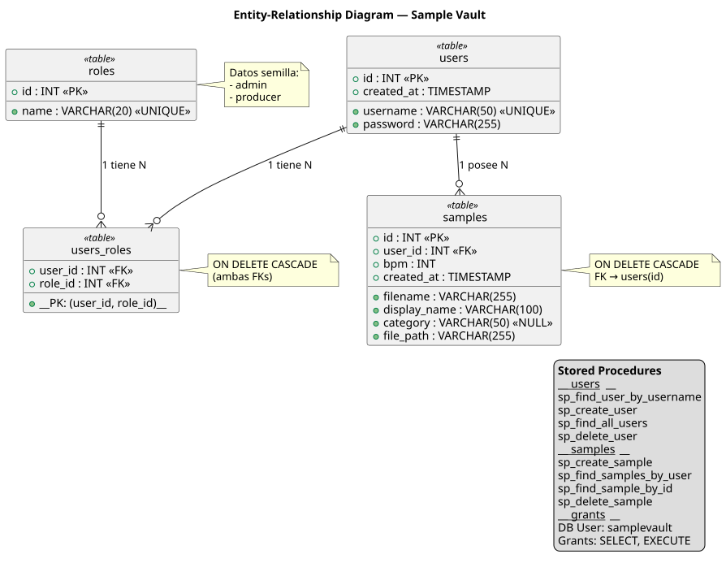

# Entity-Relationship Diagram — Sample Vault

> Modelo de datos: tablas, relaciones, stored procedures y permisos.

## Tablas

| Tabla | PK | FKs | Restricciones |
| ------- | ---- | ----- | --------------- |
| `roles` | `id` | — | `name UNIQUE` |
| `users` | `id` | — | `username UNIQUE` |
| `users_roles` | `(user_id, role_id)` | `user_id → users(id)`, `role_id → roles(id)` | `ON DELETE CASCADE` en ambas |
| `samples` | `id` | `user_id → users(id)` | `ON DELETE CASCADE` |

## Stored Procedures

### Usuarios

| SP | Parámetros | Uso |
| ---- | ------------ | ----- |
| `sp_find_user_by_username` | `p_username` | Login — trae usuario con su rol |
| `sp_create_user` | `p_username, p_password, p_role_name` | Registro — crea usuario y asigna rol |
| `sp_find_all_users` | — | Admin — lista todos los usuarios con roles |
| `sp_delete_user` | `p_id` | Admin — elimina usuario (cascade a roles y samples) |

### Samples

| SP | Parámetros | Uso |
| ---- | ------------ | ----- |
| `sp_create_sample` | `p_user_id, p_filename, p_display_name, p_category, p_bpm, p_file_path` | Subida de sample |
| `sp_find_samples_by_user` | `p_user_id` | Listar mis samples |
| `sp_find_sample_by_id` | `p_id, p_user_id` | Buscar un sample (filtrado por dueño) |
| `sp_delete_sample` | `p_id, p_user_id` | Eliminar sample (filtrado por dueño) |

## Seguridad (Principle of Least Privilege)

El usuario de base de datos `samplevault` tiene únicamente permisos `SELECT, EXECUTE` sobre `samplevault.*`. No puede hacer INSERT/UPDATE/DELETE directamente sobre las tablas. Toda mutación pasa por stored procedures, lo que:

- Previene SQL injection (los SP usan parámetros)
- Centraliza las reglas de negocio (ownership filter)
- Impide operaciones no autorizadas incluso si las credenciales se exponen
