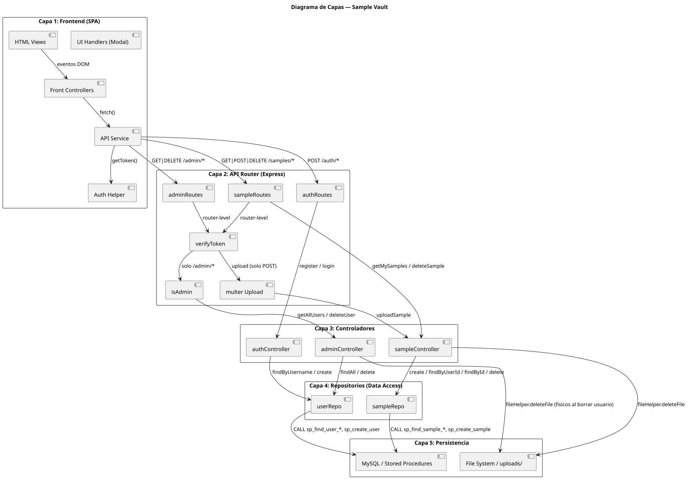

# Diagrama de Capas — Sample Vault

> Arquitectura en 5 capas. Muestra cómo fluyen las dependencias desde el frontend hasta la persistencia.



## Flujo de la cadena de middlewares

```text
Pública:
  /api/auth/login       → authController.login
  /api/auth/register    → authController.register

Protegida (verifyToken):
  /api/samples/*
    GET /my-samples     → sampleController.getMySamples
    POST /upload        → multer → sampleController.uploadSample
    DELETE /:id         → sampleController.deleteSample

Protegida (verifyToken + isAdmin):
  /api/admin/*
    GET /users           → adminController.getAllUsers
    DELETE /users/:id    → adminController.deleteUser
```

## Ubicación de validaciones por capa

| Capa | Validaciones que impactan |
| ---- | -------------------------- |
| **Capas 1-2** (Frontend + Router) | Estructura incompleta (login), manipulación de token JWT |
| **Capa 2** (Multer) | Tipo MIME inconsistente, límite de peso |
| **Capa 3** (Controladores) | Longitud de contraseña, coherencia del BPM, borrado fantasma |
| **Capas 3-4** (Controladores + Repos) | Eliminación de recurso ajeno, SQL injection |
