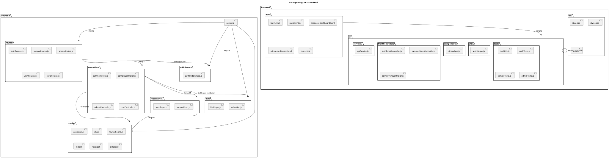

# Diagrama de Paquetes — Sample Vault

> Estructura de directorios y dependencias entre módulos del backend y frontend.

## Backend

| Paquete | Archivos | Responsabilidad |
| --------- | ---------- | ----------------- |
| `routes/` | 5 archivos | Define endpoints y monta middlewares |
| `controllers/` | 4 clases | Lógica de negocio y validación (auth, sample, admin, test) |
| `middleware/` | 1 archivo | `verifyToken` + `isAdmin` |
| `repositories/` | 2 archivos | Data access mediante stored procedures |
| `config/` | 6 archivos | Conexión DB, multer, constants, init.sql, reset.sql, delete.sql |
| `utils/` | 2 archivos | `fileHelper.deleteFile` + `validation.validateInput` |

## Frontend

| Paquete | Archivos | Responsabilidad |
| --------- | ---------- | ----------------- |
| `html/` | 5 archivos | Vistas SPA estáticas |
| `js/services/` | 1 archivo | `apiService.request()` wrapper de fetch |
| `js/frontControllers/` | 3 archivos | Manejadores de eventos DOM + API calls |
| `js/components/` | 1 archivo | `showModal()` para notificaciones |
| `js/utils/` | 1 archivo | `authHelper` (token en localStorage) |
| `js/tests/` | 4 archivos | Suite de tests manuales DOM |
