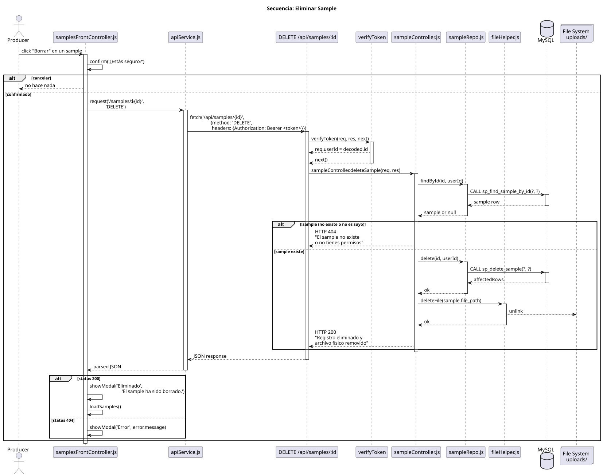

# Secuencia: Eliminar Sample

> Flujo completo de eliminación de sample. Muestra ownership check → DB delete → file cleanup.

## Puntos de validación en este flujo (orden de ejecución)

| Paso | Validación asociada | Código HTTP |
|------|---------------------|-------------|
| verifyToken | Token inválido | 401/403 |
| findByIdOnly(id) | Sample no existe (ID inexistente) | 404 |
| userRole === 'admin' | ¿Es admin? → saltea verificación de dueño | — |
| findById(id, userId) | Recurso ajeno (sample existe pero no es del usuario) | 403 |

## Ownership enforcement

El control de propiedad se implementa **en dos consultas** para distinguir 403 de 404:

1. **Primera consulta:** `sp_find_sample_by_id_only(p_id)` — busca el sample sin filtrar por dueño.
   - Si no devuelve filas → **404** "El sample solicitado no existe."
2. **Segunda consulta (solo si no es admin):** `sp_find_sample_by_id(p_id, p_user_id)` — filtra por dueño.
   - Si no devuelve filas → **403** "No tienes permisos para eliminar este sample."
3. Admin elimina directamente con el `user_id` del dueño real (obtenido en paso 1).

## Archivos involucrados

- `frontend/js/frontControllers/samplesFrontController.js` — confirm() + apiService
- `backend/controllers/sampleController.js` — método `deleteSample` (two-step lookup)
- `backend/repositories/sampleRepo.js` — `findByIdOnly`, `findById`, `delete`
- `backend/utils/fileHelper.js` — eliminación física del archivo
