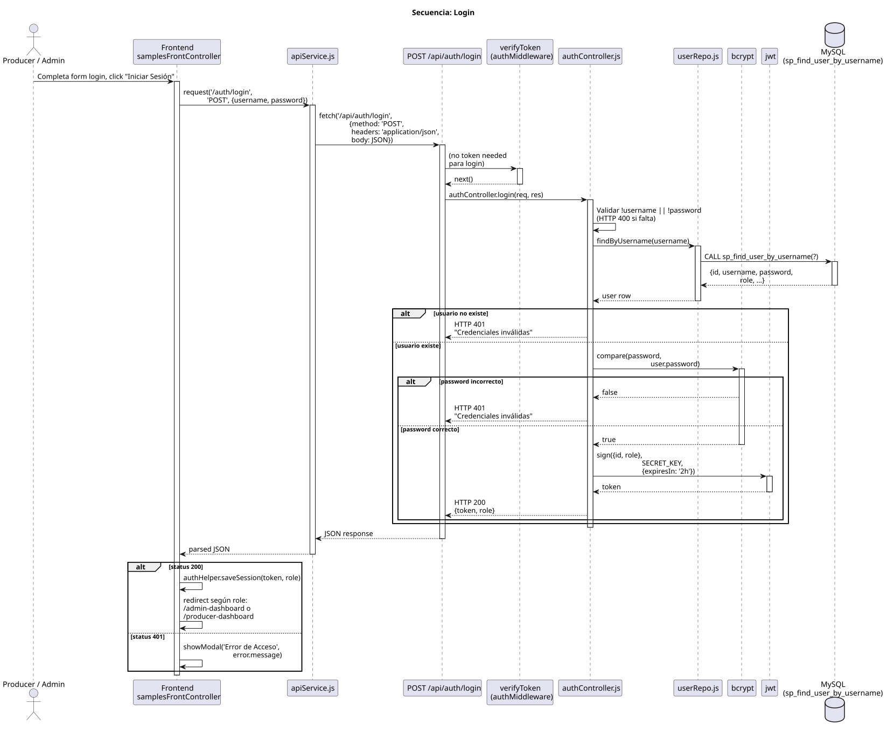

# Secuencia: Login

> Flujo completo de autenticación. Muestra frontend → API → bcrypt → JWT.

## Puntos de validación en este flujo

| Paso | Validación asociada | Código HTTP |
| ------ | --------------------- | ------------- |
| Validación de campos | Estructura incompleta (login) | 400 |
| bcrypt.compare | Credenciales inválidas | 401 |
| jwt.verify | Token manipulado | 401 |

## Archivos involucrados

- `frontend/js/frontControllers/authFrontController.js` — captura submit, llama apiService
- `frontend/js/services/apiService.js` — fetch con manejo de 401
- `backend/controllers/authController.js` — lógica de login
- `backend/repositories/userRepo.js` — `findByUsername`
- `backend/middleware/authMiddleware.js` — `verifyToken` (no usado en login, sí en rutas protegidas)
