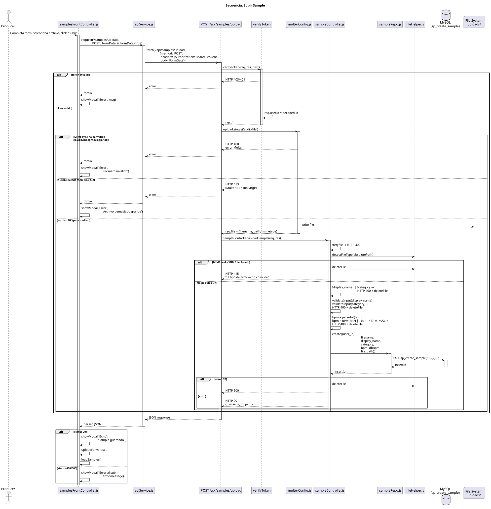

# Secuencia: Subir Sample

> Flujo completo de subida de archivo de audio. Muestra multer → validaciones → DB → file system.

## Puntos de validación en este flujo

| Paso | Validación asociada | Código HTTP |
| ------ | --------------------- | ------------- |
| verifyToken | Token inválido/ausente | 401/403 |
| multer fileFilter | Tipo MIME inconsistente | 400 |
| multer limits | Límite de peso | 413 (no implementado aún) |
| Controller `!display_name \|\| !category` | Metadatos obligatorios | 400 |
| Controller `parseInt(bpm) \|\| 0` | BPM inválido (no implementado aún) | 400 |

## Archivos involucrados

- `frontend/js/frontControllers/samplesFrontController.js` — captura submit del form
- `backend/config/multerConfig.js` — fileFilter + diskStorage
- `backend/controllers/sampleController.js` — validación + persistencia
- `backend/repositories/sampleRepo.js` — `sp_create_sample`
- `backend/utils/fileHelper.js` — limpieza en caso de error
