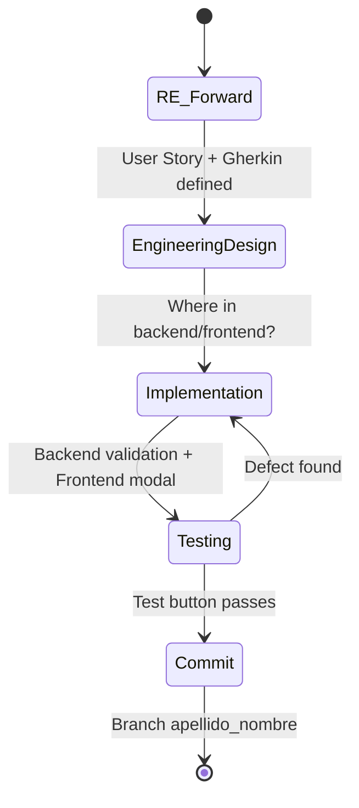

# SDLC Approach — Sample Vault (Brownfield)

## Modelo adoptado: Evolutivo / Iterativo con mini-ciclos

Este proyecto no inicia desde cero. Es un sistema heredado (brownfield) con código funcionando pero sin documentación de requerimientos. Por lo tanto, el ciclo de vida clásico en cascada no aplica.

### Ciclo por validación (cada una es un mini-ciclo completo)

### Fases del mini-ciclo

| Fase | Artefacto | Descripción |
| ------ | ----------- | ------------- |
| **1. RE (forward-only)** | `docs/requirements/req-NNN-slug.md` | User Story + Criterios de Aceptación (Gherkin). No se reconstruye el pasado, se especifica lo nuevo. |
| **2. Diseño** | `docs/requirements/req-NNN-slug.md` (sección implementación) | Se identifica dónde va cada cambio: controlador, middleware, frontend controller, test. |
| **3. Implementación** | Código fuente | Backend (validación + HTTP status) + Frontend (showModal con mensaje específico). |
| **4. Test** | `frontend/js/tests/` | Botón DOM existente que prueba el escenario contra la API real. |
| **5. Commit** | Branch `apellido_nombre` | Un commit por validación completada. |

### ¿Por qué evolutivo?

1. **No hay SRS previo** — waterfall requeriría especificar todo antes de codificar, pero el sistema ya existe sin documentación.
2. **Cada validación es independiente** — pueden desarrollarse en paralelo por distintos integrantes.
3. **Feedback temprano** — los tests DOM verifican inmediatamente si la validación funciona.
4. **Alineación con la entrega** — el TP pide una validación por alumno, lo que naturalmente forma ciclos atómicos.

### Relación con el SDLC clásico

| Fase SDLC clásica | Cómo se aplica acá |
| --- | --- |
| **Análisis (RE)** | User Story + Gherkin para la validación elegida. No se documenta todo el sistema. |
| **Diseño** | Mapa de dónde tocar: ruta, controlador, middleware, frontend controller, test file. |
| **Implementación** | Código backend y frontend. |
| **Pruebas** | Botón de test en tests.html + verificación manual del modal. |
| **Despliegue** | No aplica (proyecto académico). |
| **Mantenimiento** | Cada ciclo nuevo agrega una validación más al backlog. |

### Referencias

- [[04-projects/prj-tecnicatura-superior-sistemas/year/02/practicas-profesionalizantes-ii/30-assignments/2026-06-02-practico-01/code/docs/requirements/README|Requirements Engineering strategy]]
- [[validations-backlog|Validations backlog]]
- [[RE-brownfield-reference|RE Brownfield - Referencia Rapida]] (nota metodológica general en Ingeniería de Software I)
