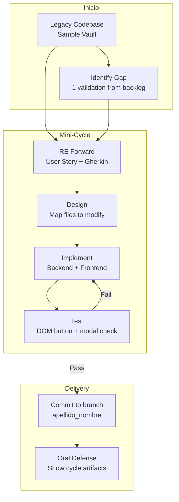
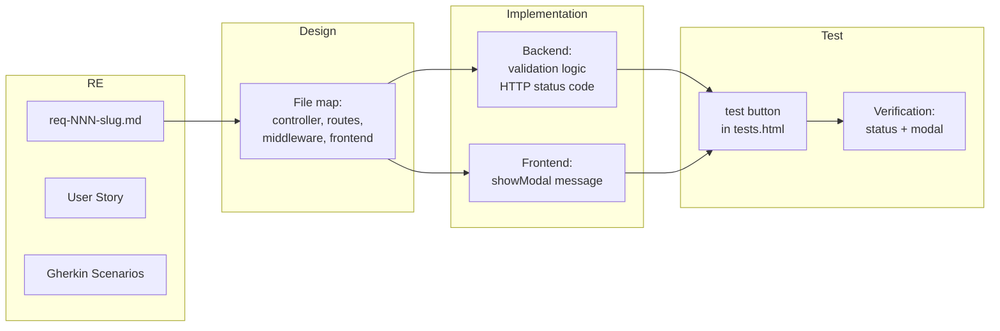
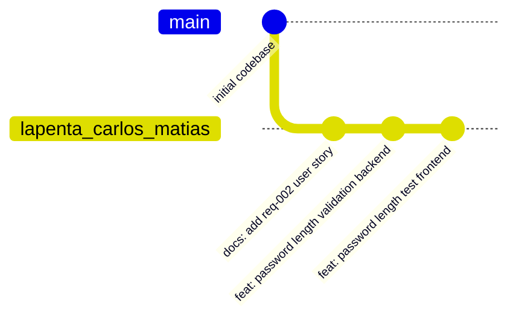

# SDLC Process Diagram — Sample Vault

## Visión general del ciclo adaptado



## Artefactos por fase



## Layout de archivos

```text
code/
├── docs/                         ← Artefactos SDLC
│   ├── sdlc/
│   │   ├── README.md             ← Enfoque general
│   │   ├── approach.md           ← Justificación brownfield
│   │   └── process-diagram.md    ← Este archivo
│   ├── requirements/
│   │   ├── README.md             ← Estrategia RE en brownfield
│   │   ├── validations-backlog.md ← Backlog con estado
│   │   └── req-*.md              ← User Stories + Gherkin
│   └── RE-brownfield-reference.md
├── backend/
│   ├── controllers/              ← Validación implementada
│   ├── middleware/               ← Guards, verifyToken
│   ├── config/
│   │   └── multerConfig.js      ← Filtros MIME, límites
│   └── ...
├── frontend/
│   ├── js/
│   │   ├── frontControllers/    ← showModal en catch
│   │   ├── tests/               ← Nuevo botón de test
│   │   └── ...
│   └── ...
└── ...
```

## Flujo de trabajo por alumno


